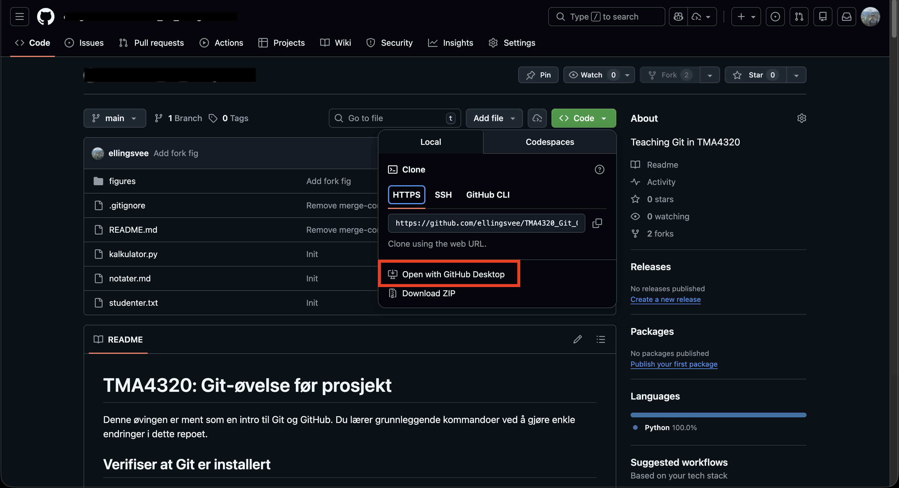

# TMA4320: Git-øvelse før prosjekt

Denne øvingen er ment som en intro til Git og GitHub. Du lærer grunnleggende kommandoer ved å gjøre enkle endringer i dette repoet.

## Verifiser at Git er installert
Åpne terminalen og kjør:
```bash
git --version
```
Dersom Git er installert, vil du se noe som `git version 2.x.x`. 

## Bruke GitHub desktop for enklere håndtering av Git

GitHub Desktop er et brukervennlig GUI for Git som er utviklet av Microsoft. Det kan lastes ned gratis fra https://desktop.github.com/download/. Last ned og installer programmet, og logg inn med din GitHub-konto.


## Del 1: Sette opp et eget GitHub-repo, og laste det ned til din maskin
### Bruk dette repoet som template for ditt eget repo
For prosjektene skal alle gruppene ha sitt eget privat GitHub-repo for å jobbe videre med koden i det originale repoet. For å lage ditt eget repo basert på dette, trykk på "Use this template" knappen øverst til høyre på denne siden og velg "Create a new repository".


Deretter gir du repoet et navn (f.eks. `TMA4320_Oving_<Ditt_navn>`), velger "Private" og trykker på "Create repository from template".


### Klon repoet til maskinen din ved bruk av GitHub Desktop
I det nye repositoriet du har generert, velg "Code" og trykk på "Open with GitHub Desktop". Velg deretter hvor du vil lagre repoet lokalt på maskinen din, og trykk "Clone".



Etter kloningen er ferdig kan du åpne prosjektet i Visual Studio Code ved å trykke på "Open in Visual Studio Code".


Når dere har åpnet prosjektet i VSCode, kan dere åpne en terminal i VSCode ved å trykke på `Ctrl`/`Cmd`+ `j` eller gå til "Terminal" -> "New Terminal" i menyen.


### Sjekk statusen
Den første kommandoen du bør lære deg er `git status`. Denne kommandoen viser deg hvilken branch du er på, og om det er noen endringer i filene dine. Skriv følgende inn i terminalen og trykk Enter
```bash
git status 
```
Dersom alt er som det skal, vil du se noe som dette:
```
On branch main
Your branch is up to date with 'origin/main'.

nothing to commit, working tree clean
```


## Del 2: Gjør din første endring

### Oppgave: Legg til navnet ditt i `studenter.txt`

1. Åpne filen `studenter.txt` i en teksteditor
2. Legg til navnet ditt på en ny linje
3. Lagre filen

### Sjekk hva som er endret
```bash
git status
git diff
```
Merk at du kan også se endringene i GitHub Desktop.

### Legg til endringen og commit
```bash
# Legg til filen til staging area
git add studenter.txt

# Commit alle endringer som er i staging area
# `-m` flagget lar deg legge til en commit-melding direkte i kommandoen
git commit -m "La til mitt navn i studentlisten"
```
Merk at du kan også adde og committe i GitHub Desktop.

### Push til GitHub
For å sende endringen til GitHub, gå til GitHub Desktop og trykk på "Push origin" knappen øverst.


Gå til GitHub og sjekk at endringen dukket opp i!

## Del 3: Jobbe med branches

Branches lar deg jobbe på nye features uten å ødelegge hovedkoden.

### Lag en ny branch
```bash
git branch update-students      # Lag en ny branch kalt "update-students"
git switch update-students      # Bytt fra "main" branch til den nye branchen
```

### Bruk din teksteditor og legg til en ny student i `studenter.txt`
Legg til enda en ny student i `studenter.txt` og lagre filen.  Sjekk hva som er endret
```bash
git status 
git diff
```

### Commit endringene
```bash
git add studenter.txt
git commit -m "La til en ny student i studentlisten"
```

### Merge branchen tilbake til main (lokalt)
Nå som du har gjort endringer på `update-students`-branchen, kan du merge den tilbake til `main`:
```bash
git switch main                         # Bytt tilbake til main-branchen. Her er ikke endringene dine enda.
git merge update-students               # Merge inn endringene fra update-students
```
Du har nå laget en branch, gjort endringer, og merget dem tilbake til main. Bruk `git log` for å se commit-historikken. Deretter pusher du endringene til GitHub via GitHub Desktop på samme måte som tidligere.

### Viktig: Merge-conflicts

Merge conflicts oppstår når to branches endrer samme linje i en fil. Når vi skal merge disse branchene vil Git ikke vite hvilken endring som skal beholdes, og du må løse konflikten manuelt. Dette er en vanlig situasjon når flere personer jobber på samme prosjekt, og kan virke skremmende i starten. 

Heldigvis er ikke dette så vanskelig som det ser ut som. Jeg anbefaler å bruke 5 minutter etter forelesning på å se denne videoen. Deretter kan du prøve å lage en merge-conflict self, og håndtere den slik som forklart. 

https://www.youtube.com/watch?v=DloR0BOGNU0

[](https://www.youtube.com/watch?v=DloR0BOGNU0)


## Del 4: Push branches og Pull Requests på GitHub

Nå som du har lært å jobbe med branches lokalt, skal vi se hvordan du bruke egne branches på GitHub. Dette kan være nytting når dere skal samarbeide på prosjektet.

### Push en branch til GitHub
La oss først lage enda en ny branch med noen endringer som vi kan pushe:
```bash
git branch fix-area      # Lag en ny branch kalt "fix-area"
git switch fix-area      # Bytt fra "main" branch til den nye branchen
```

### Bruk din teksteditor og fiks beregningen av arealet i `area.py`

Nåværende funksjon for å beregnige arealet av en sirkel er feil.
```python
def circle_area(radius: np.ndarray) -> np.ndarray:
    """Calculate the area of a circle given its radius."""
    return np.pi * radius
```
Fiks funksjonen til å korrekt bruke formelen $A = πr^2$. Funksjonen skal returnere `np.pi * radius ** 2`. Ikke bekymre deg dersom VSCode advarer om at `np` ikke er tilgjenglig (dette er ikke relevant for denne øvingen).

### Commit endringene dine i branchen
```bash
git add area.py
git commit -m "Fikset beregning av sirkelareal"
```
### Push branchen til GitHub

I stedet for å merge branchen til main lokalt, skal vi pushe branchen til GitHub slik at vi kan lage en Pull Request derfra.  Går vi nå inn på GitHub Desktop, vil vi se at det er en ny branch som ikke er pushet enda. Trykk på "Publish branch" for å sende branchen til GitHub.


Inne på GitHub vil du nå se den nye branchen under dropdown-menyen.


### Lag en Pull Request til din egen main-branch
Inne på GitHub kan du lage en Pull Request (PR) for å merge endringene fra `github-test` branchen til `main` branchen. Mens du er inne i `main` branchen på GitHub, trykk på "Compare & pull request" i notifikasjonen som dukker opp. Du kan nå gjennomgå endringene og lage en PR.


Deretter trykker du på "Merge pull request" for å fullføre mergen.


Du har nå merget en branch via en Pull Request i ditt eget repo. På denne måten kan flere gruppemedlemmer jobbe på egne branches og sende Pull Requests til main-branchen når de er ferdige.

### Hent endringene fra GitHub til din lokale main-branch
For å hente de nyeste endringene fra GitHub til din lokale main-branch, bytt først til main-branchen:
```bash
git switch main
```
Deretter velger du "Fetch origin" i GitHub Desktop for å hente de nyeste endringene fra GitHub. Sjekk at endringen du gjorde i `area.py` nå er med i din lokale `main`-branch.


## Del 6: Bruk av .gitignore

Noen filer skal ikke være med i Git, for eksempel store datafiler, midlertidige filer, eller autogenererte filer. Filen `.gitignore` forteller Git hvilke filer og mapper som skal ignoreres.

1. Last ned [dette bildet](https://backends.it.ntnu.no/user-profile-service/rest/files/37db5b57-f824-3b92-bfb3-c4f6e4d543ab) til repo-mappen, og lagre det som `brynjulf.jpg`.

2. Sjekk status:
```bash
git status
```
Du vil se at den nye fila `brynjulf.jpg` er "untracked". Dette betyr at Git legger merke til at fila er lagt til, men den er ikke med i noen commit enda. Dersom vi vet at vi aldri vil ha denne fila med i Git, kan vi bruke `.gitignore` for å fortelle Git å ignorere den.

3. Åpne `.gitignore` fila i en teksteditor og legg til:
```bash
brynjulf.jpg
```

5. Sjekk status igjen:
```bash
git status
```
Nå vil du se at `brynjulf.jpg` ikke lenger vises som en untracked fil!

### Nyttige .gitignore patterns:
- `*.pdf` - ignorerer alle PDF-filer
- `mappenavn/` - ignorerer hele mappen "mappenavn"
- `temp*` - ignorerer alle filer som starter med "temp"

6. Commit .gitignore filen:
```bash
git add .gitignore
git commit -m "Oppdaterte .gitignore"
```

**Tips:** GitHub har en samling av nyttige .gitignore-templates for ulike språk: [github.com/github/gitignore](https://github.com/github/gitignore) 

**Obs:** `.gitignore` påvirker kun filer som ikke allerede er tracket av Git. Hvis du allerede har commitet en fil, må du fjerne den fra Git-historikken for at `.gitignore` skal fungere på den filen.

## Oppsummering av brukte kommandoer

```bash
# Sjekke status og endringer
git status                      # Se hva som er endret
git log                         # Se commit-historikk
git diff                        # Se hva som er endret i filer

# Legge til og committe endringer
git add <filnavn>               # Legg til en fil for commit. Evt. bruk "git add ." for å legge til alle endrede filer.
git commit -m "Commit melding"  # Lag en commit med en melding


# Jobbe med branches
git branch                      # Se alle branches
git branch <branch-navn>        # Lag en ny branch
git switch <branch-navn>        # Bytt til en annen branch
git merge <branch-navn>         # Merge en branch inn i den nåværende branchen
```
**Merk:** Dette er bare et utvalg av de mest brukte kommandoene. Git har mange flere funksjoner og kommandoer som kan være nyttige i forskjellige situasjoner.

## Generelle tips

- Pull før du begynner å jobbe (for å få andres endringer)
- Test koden din før du pusher
- Bruk branches for nye features
- "Atomic commits": Gjør små, meningsfulle commits. Ikke commit store endringer på en gang.

Andre nyttige ressurser:
- [Git Cheat Sheet](https://education.github.com/git-cheat-sheet-education.pdf)
- [Pro Git Book](https://git-scm.com/book)
- [Philomatics Youtube kanal](https://www.youtube.com/@philomatics)


## Vil også nevne: Arbeide med Git i terminalen
Dersom du ønsker å bruke Git direkte i terminalen uten GitHub Desktop, er du nødt til å sette opp SSH-nøkler for autentisering med GitHub. Dette kan du gjøre ved å følge denne guiden:

https://docs.github.com/en/authentication/connecting-to-github-with-ssh/generating-a-new-ssh-key-and-adding-it-to-the-ssh-agent

**Merk:** Dette kan være litt krevende å sette opp, personlig spør jeg som regel AI om hjelp!

Etter at du har satt opp SSH-nøkler, kan du bruke følgende kommandoer i terminalen
```bash
git clone <repo-url>    # Klon både offentlige og private repoer
git push                # Push endringer til GitHub
git pull                # Hent og slå sammen endringer fra GitHub
```

## Vil også nevne 2: Andre GUIs for Git
Ut over GitHub Desktop finnes det flere andre GUI-verktøy for Git som kan være nyttige. To populære alternativer er:

### LazyGit (min personlige favoritt)
LazyGit er en terminal-basert GUI (en TUI!). Personlig bruker jeg LazyGit for 90% av mine Git-operasjoner, og kun kommandolinen for avanserte ting. Koden er åpen kildekode og programmet kan lastes ned fra [LazyGit GitHub Repository](https://github.com/jesseduffield/lazygit).


### Source Control i VSCode
VSCode har innebygd støtte for Git gjennom Source Control-panelet. Finn mer informasjon på [Source Control in VS Code](https://code.visualstudio.com/docs/sourcecontrol/overview).


